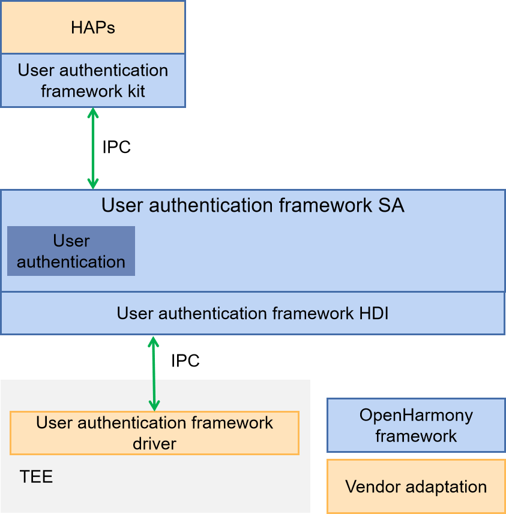

# Unified User Authentication Widget

## Introduction

**Unified authentication widget** comes with a unified user authentication framework (user_auth_framework), providing unified user identity authentication widget capabilities. When the unified user authentication framework processes user authentication requests, it provides a user authentication interaction interface, supports users to switch authentication auth types or cancel authentication through interface operation options, and supports business custom widget display information.

#### Software Architecture


## Directory Structure

```
//base/useriam/auth_widget
├── entry                              # entry module code
│   ├── src/main
│   │          ├─ets
│   │          │  └─extensionability   # System dialog implementation
│   │          │  └─common             # Common implementation
│   │          │  └─pages              # Dialog pages
│   │          │  └─image              # Image files
│   │          └─resources             # Resource configuration files
│   │          └─module.json5          # Global configuration files
│   └─ src/ohostest                    # Unit testing implemented through arkXTest
├── signature                          # Certificate files
├── LICENSE                            # License files
└── figures                            # Architecture figures
```

## Building the Unified Authentication Widget

In the root directory of the OpenHarmony source code, run the following command to separately build the unified authentication widget component:

```
./build.sh --product-name rk3568 --ccache --build-target useriam_auth_widget
```

> NOTE
>
> --product-name indicates the product name, for example, rk3568.
>
> --ccache indicates the cache function used during the compilation.
>
> --build-target indicates the name of the component to build.

## Usage

### Usage Guidelines

1. The unified authentication widget is a UIExtensionAbility implemented using the system's pop-up capability, corresponding to the sysDialog/userAuth extensionType of component UIExtensionComponent; It is a non resident system preset application that can only be pulled and managed by the unified authentication framework, and the interface is not open to the public.
2. If the caller uses the unified authentication widget, they only need to refer to the northbound usage guide of the unified authentication framework and choose to use the interface getUserAuthInstance with widget, where AuthParam specifies authentication parameters and WidgetParam specifies widget display parameters.

## Repositories Involved

**[useriam_user_auth_framework](https://gitee.com/openharmony/useriam_user_auth_framework)**