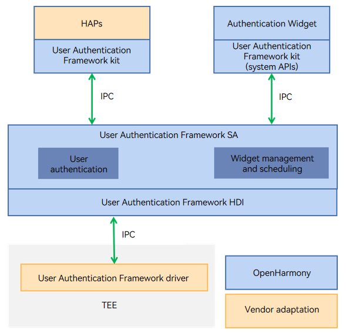

# Authentication Widget

## Introduction

The Authentication Widget works with the User Authentication Framework (user_auth_framework) to provide a user authentication interaction interface when the user_auth_framework processes user authentication requests. The user interface provided by the authentication widget supports custom display information and provides buttons for the user to switch the authentication mode or cancel the authentication.

**Figure 1** Authentication Widget architecture



## Directory Structure

```
//base/useriam/auth_widget
├── entry                              # entry module code
│   ├── src/main
│   │          ├─ets
│   │          │  └─extensionability   # Implementation of system dialog boxes
│   │          │  └─common             # Common components and utils
│   │          │  └─pages              # Dialog boxes displayed during the user authentication
│   │          │  └─image              # Preinstalled icon resources
│   │          └─resources             # Resource files
│   │          └─module.json5          # Global configuration file
│   └─ src/ohostest                    # Unit test implemented by arkXTest
├── signature                          # Certificates
└── LICENSE                            # License file
└── figures                            # Figures used in the README
```

## Building the Authentication Widget

In the root directory of the OpenHarmony source code, run the following command to build the Authentication Widget separately:

```
./build.sh --product-name rk3568 --ccache --build-target auth_widget
```

> **NOTE**
>
> --**product-name** specifies the product name, for example, **rk3568**.
>
> --**ccache** specifies the cache function used during the compilation.
>
> --**build-target** specifies the component to build.

## Usage

### Usage Guidelines

- The Authentication Widget provides the default user identity authentication interface. For details about how to use the APIs, see the API reference of the User Authentication Framework. Use the **getUserAuthInstance** method with the widget to create an authentication instance, use the **AuthParam** to specify authentication parameters, and use **WidgetParam** to specify widget display parameters.
- To ensure consistent user identity authentication experience, the authentication APIs that do not provide the user authentication interface will be deprecated. You are advised to use the authentication APIs provided by API version 10.

## Repositories Involved

**[useriam_user_auth_framework](https://gitee.com/openharmony/useriam_user_auth_framework)**
