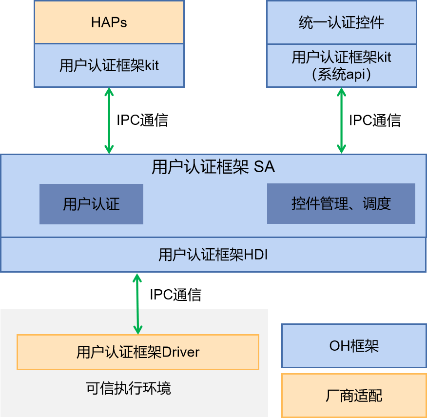

# 统一认证控件

- [简介](#简介)
- [目录](#目录)
- [说明](#说明)
  - [使用说明](#使用说明)
- [相关仓](#相关仓)
## 简介

**统一认证控件** 配套统一用户认证框架（user_auth_framework），在统一用户认证框架处理用户认证请求时，提供用户认证交互界面。界面支持调用的业务应用自定义标题等显示信息，并提供相应的功能按钮支持用户切换认证方式或取消认证。
**图1** 统一认证控件架构图


## 目录

```
//base/useriam/auth_widget
├── entry                              # entry模块目录
│   ├── src/main
│   │          ├─ets
│   │          │  └─extensionability   # 系统弹框扩展能力实现，入口
│   │          │  └─common             # 公共工具目录
│   │          │  └─pages              # 弹框内容页面
│   │          │  └─image              # 页面使用的预置图标资源
│   │          └─resources             # 资源文件
│   │          └─module.json5          # 全局配置文件
│   └─ src/ohostest                    # arkXTest实现的自动化单元测试
├── signature                          # 证书文件目录
├── LICENSE                            # 许可文件
└── figures                            # readme的截图
```

## 编译构建

在OpenHarmony源码根目录下，调用以下指令，单独编译统一身份认证控件部件。

```
./build.sh --product-name rk3568 --ccache --build-target auth_widget
```

> 说明：
>
> --product-name：产品名称，例如rk3568。
>
> --ccache：编译时使用缓存功能。
>
> --build-target: 编译的部件名称。

## 说明

### 使用说明

1.  统一身份认证控件提供了系统默认的用户身份认证界面，具体调用方式请参考统一认证框架北向使用指导，选择使用带控件的接口getUserAuthInstance,AuthParam指定认证参数，WidgetParam指定控件显示参数。
2.  为确保用户在系统上有统一的的身份认证体验，不带认证界面的身份认证API后续将逐步废弃，建议开发者使用API 10提供的新用户身份认证接口。

## 相关仓

**[useriam_user_auth_framework](https://gitee.com/openharmony/useriam_user_auth_framework)**